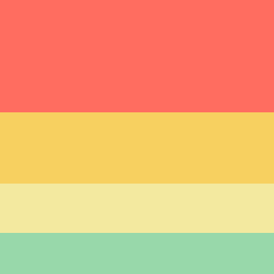

# Design justifications

 We’ve decided to create our website mobile first as it will be easier to then implement a desktop design later, whereas a desktop first design means having to squeeze or cut down on features for mobile.

This is the colour scheme we have chosen:

We chose a colour scheme that includes a red and a green (for the correct and incorrect answers in the Review section) and the one we have chosen has good contrast for accessibility but also gives a fun aesthetic (and what is a quiz if not a ball of fun).

The name textbox and the final score are in orange to differentiate them from the buttons.

The user enters their name at the start so that there is a name attached to the saved score. This also allows us to create a leaderboard should we have the time to.

We could have a logo that is displayed on every screen.
